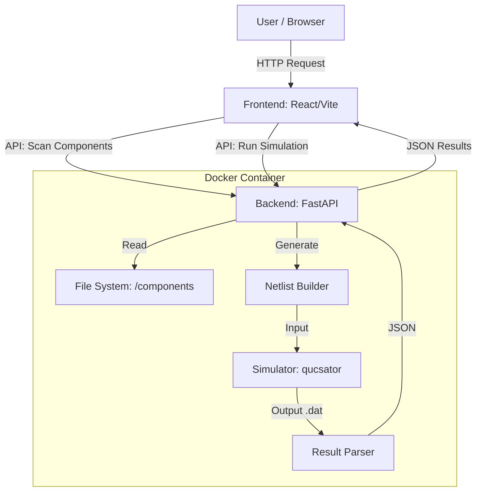

# Qucs-Web Architecture & Design

## 1. High-Level Architecture



## 2. Folder Structure

```
/home/avishkar/QUCS/
├── components/                 # Component Library (User extensible)
│   ├── resistor/
│   │   ├── component.json      # Metadata & Parameters
│   │   ├── symbol.svg          # Schematic Symbol
│   │   └── model.net           # Qucs Netlist Template
│   ├── capacitor/
│   │   ├── ...
│   └── voltage_dc/
│       ├── ...
├── backend/                    # Python FastAPI application
│   ├── app.py                  # Entry point
│   ├── netlist.py              # Netlist generation logic
│   ├── parser.py               # Output parsing logic
│   ├── sandbox.py              # Execution wrapper
│   └── requirements.txt
├── frontend/                   # React application
│   ├── src/
│   │   ├── components/         # UI Components
│   │   ├── schematic/          # Canvas/Editor Logic
│   │   └── App.jsx
│   └── package.json
├── Dockerfile                  # Multi-stage build (Qucs + App)
└── docker-compose.yml          # Orchestration
```

## 3. Data Flow

1.  **Startup**: Backend scans `components/` and caches metadata (ID, Name, Ports, Params).
2.  **Client Init**: Frontend fetches component list from `/api/components`.
3.  **Schematic Capture**: User places nodes. Frontend maintains a graph model (Nodes, Edges, Components).
4.  **Simulation Request**:
    *   Frontend sends `{ circuit: [instances, connections], config: {...} }` to `/api/simulate`.
    *   Backend creates a temp dir.
    *   **Netlist Builder**: Iterates instances, assigns unique numeric nodes to connections, substitutes parameters into `model.net` templates, appends simulation directives (e.g., `.DC`, `.TR`).
    *   **Execution**: Runs `qucsator -i circuit.net -o circuit.dat`.
    *   **Parsing**: Reads `circuit.dat` (Qucs dataset format), converts to `{ time: [...], node1: [...] }`.
5.  **Visualization**: Frontend plots the JSON data.

## 4. Component Config Schema (`component.json`)

```json
{
  "id": "resistor",
  "name": "Resistor",
  "category": "Passive",
  "ports": ["p1", "p2"], 
  "parameters": {
    "R": {
      "type": "float",
      "default": 50,
      "unit": "Ohm",
      "description": "Resistance"
    }
  },
  "simulation": {
    "template": "model.net"
  }
}
```

## 5. Security & Isolation
*   **Docker**: The entire app runs in a container.
*   **Temp Dirs**: Every simulation runs in an ephemeral `/tmp/sim_<uuid>` directory, deleted after execution.
*   **Timeouts**: `subprocess.run` will have a strict `timeout=5s`.
